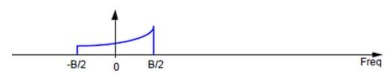
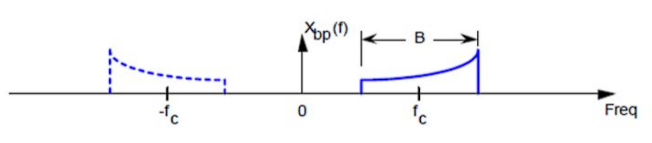

# **Pytania kierunkowe**
## 1. Widmo sygnału analogowego (podstawowo-pasmowego i pasmowego) a twierdzenie o próbkowaniu.
Sygnał analogowy zmienia się w sposóbSygnał analogowy zmienia się w sposób ciągły. Jego wartości mogą zostać określone w każdej chwili czasu. Próbkowanie jest procesem konwersji sygnału analogowego do postaci próbek pobieranych w równych odstępach czasu. Treść twierdzenia nieco różni się w zależności od postaci próbkowanego sygnału. W swojej podstawowej postaci twierdzenie o próbkowaniu dotyczy sygnałów rzeczywistych pasma podstawowego, czyli takich, których skończone widmo skupia się wokół częstotliwości 0.

Twierdzenie Kotielnikowa-Shannona zawiera informacje o tym, kiedy z sygnału dyskretnego można odtworzyć sygnał ciągły. Częstotliwość próbkowania fs nie może być mniejsza od podwojonej maksymalnej częstotliwości widma sygnału próbkowanego fmax. Wtedy mamy do czynienia z prawidłowym próbkowaniem.

 fs≥2*fmax 

 gdzie: 

 fmax - składowa sygnału o najwyższej częstotliwości 

 fs - częstotliwosc próbkowania 

W twierdzeniu o próbkowaniu wyróżniamy również częstotliwość Nyquista. Jest ona równa połowie częstotliwości fs. Znając najwyższą składową częstotliwości w mierzonym sygnale możemy dobrać odpowiednią częstotliwość próbkowania.

W praktyce często próbkowane są analogowe sygnały pasmowe czyli takie, których ograniczone pasmo jest skupione wokół pewnej częstotliwości różnej od zera. Wtedy próbkowanie z częstotliwością co najmniej dwukrotnie większą jest nieekonomiczne. W tym przypadku korzystniejsze jest próbkowanie pasmowe z częstotliwością co najmniej dwukrotnie większą od szerokości pasma które oblicza się jako B = fH - fL. Gdzie fH jest najwyższą, a fL najmniejszą częstotliwością w widmie sygnału. Pasmo jest skupione wokół częstotliwości środkowej f0 = (fL + fH)/2. Częstotliwość dobiera się za pomocą nierówności:

Jeżeli sygnał jest próbkowany z częstotliwością mniejszą niż dwukrotność częstotliwości Nyquista, w widmie przetworzonego sygnału pojawiają się błędne niskoczęstotliwościowe składowe (tzw. aliasy). Zjawisko to nazywamy aliasingiem. W takim przypadku nie jest możliwe odzyskanie sygnału ciągłego z sygnału dyskretnego. Częstotliwość sygnału odtworzonego z takich próbek wyniesie: f = |n*fs-f0|, gdzie n * fs jest wielokrotnością częstotliwości próbkowania. Przykładowo sygnał o częstotliwości 7kHz spróbkowany z częstotliwością 10 kHz po odtworzeniu da sygnał o częstotliwości 3 kHz bądź 13 kHz.

## 2. Widmo sygnału dyskretnego i transformacje (DTFT, DFT, FFT) służące do obliczania tego widma oraz powiązania tych transformat.
Sygnał dyskretny - sygnał, który powstał w wyniku dyskretyzacji (próbkowania) sygnału ciągłego (analogowego)
DTFT (Discrete Time Fourier Transform) - dyskretno-czasowe przekształcenie Fouriera
DFT (Discrete Fourier Transform) - dyskretne przekształcenie Fouriera
FFT (Fast Fourier Transform) - szybkie przekształcenie Fouriera

## 3. Twierdzenia Schannona i ich interpretacje.
## 4. Usługi w sieci telekomunikacyjnej - klasyfikacja, charakterystyki, jakość usług.
Usługa telekomunikacyjna - przesyłanie na odległość informacji (w postaci mowy, muzyki, znaków, pisma, rysunków, fotografii, obrazów, danych, itp.) za pomocą sygnałów elektrycznych, optycznych lub radiowych. Świadczona każdorazowo przez operatora (dzięki jego urządzeniom i organizacji) na rzecz użytkowników i na ich żądanie. Usługi telekomunikacyjne można podzielić na usługi podstawowe (ang. basic services), usługi dodatkowe (ang. supplementary services) i usługi dodane. Usługi podstawowe i dodatkowe są opisane w specyfikacji standardu, na którym oparta jest sieć.

Usługi podstawowe: 
- teleusługi (ang. teleservices) - usługi umożliwiające zestawienie pewnych, zdefiniowanych dla danego standardu sieci, połączeń (np. zwykłe połączenie telefoniczne, połączenie alarmowe, wysyłanie wiadomości SMS) i zapewniają w tym celu współpracę różnych elementów sieciowych i terminali końcowych.
- usługi przenoszenia (bearer services) - zapewniające transport informacji pomiędzy punktami dostępowymi sieci

Usługi dodatkowe - rozszerzają możliwości usług podstawowych. Przykładem może być możliwość ustawienia przekierowania na inny numer gdy abonent nie odpowiada, zestawienia telekonferencji lub ustawienie identyfikacji numeru dzwoniącego.

Usługi dodana - usługi nie objęte specyfikacją dla standardu, na którym oparta jest sieć. Mogą one kontrolować usługi objęte specyfikacją, bądź wykorzystywać je dla dostarczenia abonentowi dodatkowych treści i możliwości co poszerzy ofertę operatora na tle rybku. Usługi kontrolujące usługi podstawowe, oparte są zwykle o platformę sieci inteligentnych np. serwis prepaid, który kontroluje ilość środków na koncie abonenta i może w każdej chwili zakończyć połączenie lub transmisję danych. Przykładem usług, które wykorzystują usługi podstawowe dla zaoferowania informacji lub możliwości nie objętych specyfikacją sieci mogą być: umożliwienie abonentom wysyłania MMS, głosowania za pomocą SMS, nagrywania i odsłuchiwania poczty głosowej lub tzw. VoD (ang.Video on Demand).

Inne sposoby specyfikacji:
- ze względu na wymagane łącza:
    - usługi połączeniowe wymagające stworzenia kanału logicznego dla stałego połączenia na czas realizacji usługi
    - usługi bezpołączeniowe (nie wymagające stworzenia kanału)
- z punktu widzenia abonenta:
    - usługi interaktywne: konwersacyjne (dwukierunkowa wymiana informacji w czasie rzeczywistym: telefonia, wideotelefonia), przekazywanie wiadomości (dwukierunkowa wymiana informacji), wyszukiwanie/dostęp do informacji (przesyłanie do użytkownika, na jego żądanie, informacji wcześniej zgromadzonych)
    - usługi dystrybucyjne (rozsiewcze): jedokierunkowe rozprowadzanie informacji do wielu użytkowników (użytkownik nie ma wpływu na szybkość i czas przesyłania danych ani treści), usług z/bez możliwości indywidualnego sterowania prezentacją (telegazeta, telewizja programowa)

Jakość usług:
- GoS (Grade of Service) - poziom świadczonych usług - określa pewne parametry (związane z inżynierią ruchu), których wartości umożliwiają odpowiedź na pytanie o wystarczalności posiadanych zasobów (przy ustalonych założeniach, co do panujących warunków). Parametrami GoS przykładowo są: prawdopodobieństwo nieuzyskania usługi, prawdopodobieństwo strat zgłoszenia, czy prawdopodobieństwo zajętości wszystkich zasobów, które wynikają z faktu, że zdolność obsługi sieci/elementów sieci jest ograniczona i nie zawsze może sprostać istniejącemu zapotrzebowaniu ruchowemu.
- QoS (Quality of Service) - zbiór mechanizmów, które mają zapewnić dostarczenie przewidywalnego poziomu jakości usług sieciowych, poprzez zapewnienie określonych parametrów transmisji danych, w celu osiągnięcia satysfakcji użytkownika. Gwarantowana jakość usłgu jest to zestaw technologii zapewniających odpowiedni (przewidywalny) poziom usług w kontekście przepustowości, opóźnienia i zmienności opóźnienia (ang. jitter).

Przykładowe mechanizmy zapewniające jakość usług polegają na:
- kształtowaniu i ograniczaniu przepustowości
- zapewnianiu sprawiedliwego dostępu do zasobów
- nadawaniu odpowiednich priorytetów poszczególnym pakietom
- zarządzaniu opóźnieniami w przesyłaniu danych
- unikaniu przeciążeń

## 5. Narysuj schemat blokowy i omów działanie łącza radiowego.
Łącze radiowe - zestaw urządzeń służący do przesyłania i odbierania sygnału radiowego oraz środowisko propagacji, służy do nadawania i odbierania informacji za pośrednictwem fal radiowych, na wyjściu części odbiorczej nigdy nie pojawi się w 100% ta sama informacja, która została wprowadzona na wejście części nadawczej, działa poprawnie, gdy informacja jest odtwarzana z dostatecznie wymaganą dokładnością, określoną w systemach analogowych jako stosunek natężenia sygnału do natężenia szumu (S/N) na wyjściu odbiornika, a wsystemach cyfrowych poprzez Pb.

Nadajnik: Informacja I (np. ludzki głos) jest wprowadzana do przetwornika nadawczego PN i przetwarzana na sygnał elektryczny s(t) o małej częstotliwości i bardzo niskiej mocy. Wzmacniaczem małej częstotliwości nadaje sygnałowi s(t) poziom energetyczny pozwalający na przeniesienie go w pasmo wysokich częstotliwości i następnie po przejściu przez filtr dolnoprzepustowy wprowadza do przetwornika małuch częstotliwości na wysokie częstotliwości, gdzie powstaje sygnał radiowy r(t) o wysokiej częstotliwości. Następnie sygnał przechodzi przez filtr pasmowoprzepustowy.
Jego poziom energetyczny jest zbyt niski by mógł być bezpośrednio wypromieniowany do środowiska propagacji, więc wzmacniacz wysokiej częstotliwości nadaje mu odpowiednią moc PN i poprzez antenę nadawczą AN sygnał jest wysyłany w świat.

Odbiornik: Sygnał w postaci fali elektromagnetycznej jest odbierany ze środowiska propagacji przez antenę odbiorczą Ao, w wyniku czego powstaje sygnał radiowy r'(t) o wysokiej częstotliwości (nieco zmieniony w stosunku do oryginalnego sygnału r(t) przez zjawiska występujące w środowisku propagacji). Ze względu na odległość pomiędzy częścią odbiorczą a nadawczą łącza, sygnał r'(t) ma niską moc, tymczasem dla poprawnego działania modułu przenoszącego sygnał w pasmo małych częstotliwości moc ta musi być odpowiednio wysoka. Zapewnia to wzmacniacz wysokiej częstotliwości. Sygnał przechodzi przez filtr pasmowoprzepustowy następnie przechodzi przez przetwornik częstotliwości. Sygnał podstawowy s'(t) o małej częstotliwości i mocy, który następnie przechodzi przez filtr dolnoprzepustowy. Poziom energetyczny potrzebny do poprawnej pracy przetwornika odbiorczego Po uzyskuje się we wzmacniaczu małej częstotliwości. Na wyjściu ostatniego modułu pojawia się informacja I'.

Środowisko propagacji: Ogólny przypadek: powietrze, nie zawsze przewidywalne warunki, zjawiska zachodzące w środowisku: rozproszenie sygnału radiowego (malejąca wartość powierzchniowej gęstości mocy fali wraz z kwadratem odległości), tłumienie sygnału radiowego (rośnie między innymi wraz z częstotliwością i wilgotnością), zakłócenie sygnału (inne sygnały radiowe), wielodrogowośc (zaniki sygnału w punkcie odbioru).

## 6. Omów podstawowe parametry elektryczne anteny.
Antena - urządzenie elektryczne, które transformuje falę doprowadzoną w falę przestrzenną, zazwyczaj jest używana jako nadajnik lub odbiornik w komunikacji radiowej. Antena izotropowa to hipotetyczna antena, której promieniowanie (gęstość powierzchniowa mocy) nie zależy od kierunku.

Parametry elektryczne - możemy je podzielić na obwodowe (opisujące współpracę anteny z częścią przewodową) i polowe (opisujące współpracę anteny z częścią bezprzewodową - środowiskiem propagacji). Do parametrów elektrycznych anteny możemy zaliczyć: charakterystykę promieniowania, zysk anteny, impedancję anteny, sprawność anteny, polaryzację oraz pasmo.

Charakterystyka promieniowania - obrazuje w jaki sposób antena promieniuje energię w zależności o kierunku, przedstawia unormowany rozkład pola elektrycznego lub też względny rozkład gęstości powierzchniowej mocy. Jest wyznaczana w dwóch płaszczyznach: pionowej i poziomej (mogą być też przedstawione w postaci trójwyimarowej), jest normalizowana i podawana w mierze decybelowej, na jej podstawie można określić kierunek i poziom wiązki głównej, wiązek bocznych i wstecznych.

Zysk anteny - pozwala określić zdolność do kierunkowego wypromieniowania energii przez daną antenę w porównaniu do anteny wzorcowej. Informuje nas ile razy moc promieniowana przez antenę w kierunku maksymalnego promieniowania jest większa od mocy anteny wzorcowej. Jeśli nie jest zaznaczone względem czego jest liczony zysk anteny, to jest on liczony w odniesieniu do anteny izotropowej. Zależy od kierunkowości oraz od strat magnetycznych anteny wynikających z materiału zastosowanego do budowy.

Impedancja anteny - obciążenie jakie przedstawia antena dla generatora sygnału. Zależy od geometrii anteny oraz od częstotliwości. Wpływa na nią obecność innych anten oraz obiektów znajdujących się w pobliżu. Z punktu widzenia sprawności układu wymagane jest, aby wszystkie elementy toru transmisyjnego miały tą samą impedancję. Tylko wtedy nastąpi przekazanie prawie całej energii z urządzenia do anteny i jej wypromieniowanie (należy pamiętać o tym, że kable i złącza też mają pewne tłumienie). W skrajnych przypadkach duże niedopasowanie może skutkować uszkodzeniem urządzęń nadawczych. W radiokomunikacji standardowo stosuje się urządzenia o impedancji 50 Ohm.

Sprawność anteny - stosunek mocy wypromieniowanej do mocy doprowadzonej do generatora. Stosunek maksymalnego zysku energetycznego do kierunkowości. Idealna antena wypromieniowuje całą moc, ale w antenie rzeczywistej część mocy jest tracona. Straty te są skutkiem niedopasowania anteny do linii zasilającej oraz strat cieplnych w rezystancji rzeczywistej elementów anenty.

Polaryzacja - drgania fal elektromagnetycznych odbywają się w ściśle okreslonych płaszczyznach. Fale elektromagnetyczne mogą drgać zarówno w płaszczyźnie pionowej jak i poziomej. Gdy drgają tylko w jednej płaszczyźnie mówimy o polaryzacji liniowej (pionowej lub poziomej). Gdy drgają w obu płaszczyznach mówimy o polaryzacji kołowej lub eliptycznej (prawo- lub lewoskrętnej).

Pasmo - zakres częstotliwości w którym antena zachowuje nominalne parametry. Przy wyznaczaniu pasma pracy najważniejsze jest dopasowanie i w nieco mniejszym stopniu zysk oraz charakterystyka. Dość często dopasowanie i inne parametry anteny są zachowane w szerszym zakresie niż jest to podawane.

## 7. Budowa i właściwości wzmacniaczy tranzystorowych.
Wzmacniacz tranzystorowy - podstawowy element (układ) wzmacniający, stosowany obecnie w układach elektronicznych. Działa na zasadzie sterowania przepływem ładunku. Dzieląsię na tranzystory bipolarne i unipolarne (polowe). Tranzystory bipolarne sterowane są prądowo, a polowe - napięciowo. Tranzystor bipolarny pracuje w zakresie aktywnym (złącze emiterowe jest w stanie przewodzenia, a kolektorowe w stanie zaporowym). Tranzystor polowy pracuje w zakresie nasycenia. Powszechnie stosowane są wzmacniacze tranzystorowe pod postacią wmacniaczy operacyjnych, selektywnych, szerokopasmowych czy też wzmacniaczy mocy.

Tranzystor bipolarny:
- wspólny emiter (CE)
- wspólna baza (CB)
- wspólny kolektor (CC)

Tranzystor polowy:
- wspólne źródło (CS)
- wspólna bramka (CG)
- wspólny dren (CD)

Wymienione wyżej konfiguracje tworzą tzw. jednotranzystorowe wzmacniacze. Łącząc zalety poszczególnych konfiguracji można uzyskać następujące połączenia (wzmacniacze szerokopasmowe):
- połączenie CC-CB tworzy tzw. wzmacniacz różnicowy
- połączenie CE-CB tworzy tzw. kaskodę

Wspólny emiter (CE):
- najczęściej stosowana z konfiguracji
- wzmacniane napięcie sygnału wejściowego podawane jest pomiędzy bazę a emiter
- sygnał po wzmocnieniu odbierany jest pomiędzy kolektorem a emiterem
- emiter jest "wspólny" dla sygnału wejściowego i wyjściowego
- duże wzmocnienie prądowe
- duże wzmocnienie mocy
- napięcie wyjściowe odwrócone jest w fazie o 180 stopni w stosunku do napięcia wejściowego
- rezystancja wejściowa jest rzędu kilkuset Ohm
- duża rezystancja wyjściowa
- małe pasmo przenoszenia częstotliwości

Wspólna baza:
- nadaje się najlepiej do pracy na wysokich częstotliwościach
- wzmacniane napięcie sygnału wejściowego podawane jest pomiędzy emiter a bazę
- sygnał po wzmocnieniu jest odbierany pomiędzy kolektorem a bazą
- baza jest "wspólna" dla sygnału wejściowego i wyjściowego
- bardzo małe wzmocnienie prądowe (bliskie jedności)
- duże wzmocnienie napięciowe
- brak odwrócenia fazy
- mała rezystancja wejściowa
- bardzo duża rezystancja wyjściowa
- duże pasmo przenoszenia
- sygnały wyjściowe są zgodne w fazie z wejściowymi

Wspólny kolektor:
- stosowany jest jako stopień wyjściowy we wzmacniaczach wielostopniowych
- nadają się jako układy dopasowujące dwa czwórniki (bufor)
- wzmacniane napięcie sygnału wejściowego podawane jest pomiędzy bazę a kolektor
- sygnał po wzmocnieniu odbierany jest pomiędzy emiterem a kolektorem
- kolektor jest "wspólny" dla sygnału wejściowego i wyjściowego
- duże wzmocnienie prądowe
- wzmocnienie napięciowe mniejsze od jedności
- brak odwrócenia fazy
- duża rezystancja wejściowa
- mała rezystancja wyjściowa
- średnie pasmo przenoszenia

Wspólne źródło:
- stosowane w zakresie małych częstotliwości
- napięcie sygnału wejściowego podawane jest pomiędzy bramkę a źródło
- sygnał po wzmocnieniu odbierany jest pomiędzy drenem a źródłem
- źródło jest "wspólne" dla sygnału wejściowego i wyjściowego
- duże wzmocnienie napięciowe
- odwrócenie fazy o 180 stopni
- bardzo duża impedancja wejściowa
- duża impedancja wyjściowa (niepożądana dla wzmacniaczy napięciowych)

Wspólna bramka:
- nadaje się do pracy z wysokimi częstotliwościami
- wzmacniane napięcie sygnału wejściowego podawane jest pomiędzy źródło a bramkę
- sygnał po wzmocnieniu odbierany jest pomiędzy drenem a bramką
- bramka jest "wspólna" dla sygnału wejściowego i wyjściowego
- duże wzmocnienie napięciowe
- brak odwrócenia fazy
- mała impedancja wejściowa (setki Ohm)
- duża impedancja wyjściowa (pojedyncze kOhm)

Wspólny dren:
- stosowany gdy pożądana jest mała pojemność wejściowa oraz konieczność transformacji impedancji
- wzmacniane napięcie sygnału wejściowego podawane jest pomiędzy bramkę a dren
- sygnał po wzmocnieniu odbierany jest pomiędzy źródłem a drenem
- dren jest "wspólny" dla sygnału wejściowego i wyjściowego
- bardzo małe wzmocnienie napięciowe (mniejsze od jedności)
- brak odwrócenia fazy
- bardzo duża impedancja wejściowa (pojedyncze MOhm)
- mała impedancja wyjściowa (setki Ohm)

## 8. Porównanie budowy, właściwości i zastosowań układów FPGA, CPLD.
| Cechy | CPLD | FPGA |
|-|-|-|
| Akronim | Complex Programmable Logic Devices | Field Programmable Gate Array |
| Wyjaśnienie | złożone układy programowalne | programowalne matryce bramkowe |
| Struktura | makrokomórek (od kilkudziesięciu do kilkuset), architektura ma strukturę hierarchiczną, niejednorodna | regularnej matrycy bloków logicznych LUT (Look-Up Table), multiplekserów lub bramek logicznych, tablicowa |
| Ilość zasobów | średnia | duża |
| Połączenia | narzucona struktura połączeń | duża dowolność łączenia zasobów |
| Szybkość | duża | średnia |
| Technologia CMOS | EPROM, EEPROM | SRAM |
| Budowa | programowalna matryca AND, stała matryca OR, przerzutniki, dodatkowe funktory XOR, pewna liczba programowalnych multiplekserów | bloki zbudowane w oparciu o małą statyczną pamięć RAM, poiędzy poprowadzone są kanały z programowalnymi połączeniami, bloki specjalne (bloki obsługi sygnałów zegara, bloki pamięci, układy mnożące i inne) |
| Input/Output | makrokomórki są połączone bezpośrednio z końcówkami input/output | bloki bezpośrednio sąsiadujące z końcówkami input/output, jednak w celu połączenia z wyprowadzeniami konieczne jest zastosowanie bloku I/O (który zajmuje miejsce) i wytrasowanie połączenia |
| Liczba wejść | 16-18 | 4-8 |
| Liczba wyjść | 4-32 | 1-4 |
| Skomplikowane funkcje - realizacja | zajmowanie "term" z bloku sąsiadniego za pomocą równoległych układów rozszerzających | szybkie linie kaskadowania i przeniesienia |
| Bramki logiczne | od 1 do 10 tysięcy bramek logicznych | od 10 tysięcy do kilku milionów |
| Pamięć | nieulotna, która pozwala na natychmiastowe działanie po uruchomieniu | ulotna, co daje więcej możliwości. Gdy układ ulegnie uszkodzeniu można go wymienić na nowy bez potrzeby uprzedniego programowania |
| Opóźnienia | ze względu na sposób łączenia elementów opóźnienia sygnałów są w pełni przewidywalne | opóźnienia sygnałów zależą od ilości wykonanych połączeń, a ta z kolei zależy od budowy systemu i zmienia się wraz z projektem (można je oszacować dopiero po syntezie układu) |
| Zastosowanie | proste układy wymagające dużej szybkości, specyficzne zastosowania jak interfejsy, komparatory, szyfratory, automaty skończone, szyny. Bootloadery (zanik prądu nie powoduje utraty konfiguracji) dla urządze, które nie mają pamięci wewnętrznej | nadają się do tworzenia układów sekwencyjnych, układy przetwarzania informacji i sygnałów (np. w realizacjach algorytmów kryptograficznych), filtry cyfrowe, realizacja układów wykorzystujących arytmetykę rozproszoną |
| Zalety | makrokomórki wykonują bardziej specjalistyczne operacje logiczne | bardziej elastyczne, możliwe automatyczne przeprogramowanie się układu w celu uzyskania lepszej wydajności w danej chwili |

## 9. Omów relacyjny model danych.
Dane - zapis, reprezentacja faktów, zapis danych nie posiada kontekstu czy znaczenia

Model danych - jest to zbiór posługiwania się danymi:
- zbiór reguł określających strukturę danych (definicja danych)
- zbiór reguł określających operacje na danych (operowanie danymi)
- zbiór reguł określających poprawne stany bazy danych (integralność danych)

Struktura danych - w modelu relacyjnym wszystkie informacje przechowywane są w realizacjach

Macierz (tabela) - reprezentuje relacje w systemach komputerowych. Ma następujące własności:
- każdy wiersz (krotka) reprezentuje opis nowej encji - bytu, np. osoba, samochód, itp.
- opis krotki dokonywany jest za pomocą uporządkowanego zbioru atrybutów, których kolejność jest istotna - wynika z wzorca krotki
- wszystkie krotki w tabeli muszą pasować do tego wzorca
- każda krotka jest unikalna (inna)
- kolejność krotek w tabeli nie ma znaczenia
- atrybuty opisywane są przez nazwę opisową atrybutu (ustala projektant bazy danych) i nazwę typu danych, do którego krotka przynależy (zależna od systemu zarządzania bazami danych i od norm)
- wartości atrybutów muszą być atomowe (nie ma krotki w krotce)
- ilość kolumn wyznacza ilość atrybutów opisujących encje

Relacyjny model danych - relacyjna struktura danych, dostępność operatorów algebry relacji umożliwiających tworzenie, wyszukiwanie i modyfikowanie danych. Możliwość definiowania ograniczeń integralnościowych i referencyjnych

Więzy integralności - to ograniczenia kojarzone z obiektami bazy danych. Typy więzów:
- unikalność krotek relacji - niepowtarzalność krotek w relacji, zapewniają to elementy nazywane kluczem głównym
- oganiczenia referencynje - możliwość ograniczenia wartości atrybutu na podstawie zbioru atrybutów w innej tabeli, odpowiadają za to elementy nazywane kluczem obcym
- integralność krotki - dziedzina atrybutu, format wartości, związki między atrybutami w krotce
- dodatkowe więzy integralności pochodzą ze środowiska modelowanego przez bazę danych

Klucz główny i klucze obce - w modelu relacyjnym, każda krotka (wiersz) musi być unikalna. Osiąga się to za pomocą klucza głównego. Klucz główny to kolumna (klucz prosty) lub grupa kolumn (klucz złożony), która jednoznacznie identyfikuje wiersz tabeli. Każda relacja musi mieć dokładnie jeden klucz główny. Klucz obcy to taka kolumna (lub grupa kolumn), która zawiera odnośniki do klucza głównego z innej tablicy

Algebra relacji - zbiór operacji zdefiniowanychw modelu relacyjnym. Operacje działają na relacjach i wynikiem każdej operacji jest nowa relacja. Sekwencja operacji algebry relacji to wyrażenie algebry relacji, którego wynikiem jest również relacja. Podstawowe operacje: selekcja, projekcja, połączenie, operatory mnogościowe, operatory zaawansowane.

Operacje na da

## 10. Wymień interfejsy przewodowe stosowane w systemach czujnikowych i omów jeden szczegółowo.
Interfejsy przewodowe stosowane w systemach czujnikowych:
- I2C
- 1-wire
- CAN
- RS232
- RS485

I2C:
- szeregowa, dwukierunkowa magistrala służąca do przesyłania danych w urządzeniach elektronicznych
- każde urządzenie ma swój adres
- brak potrzeby projektowania interfejsu magistrali - wbudowany w układ scalony
- znana również pod akronimem IIC (Inter-Integrated Circuit) - pośredniczy pomiędzy układami scalonymi
- określa dwie najniższe warstwy modelu odniesienia OSI: warstwę fizyczną i warstwę łącza danych
- 2 kierunkowe linie: dane (SDA - Serial Data) oraz sygnał zegara (SCL - Serial Clock)
- podczas transmisji danych, sygnał na linii SDA musi być stabilny (nie może się zmieniać), gdy linia SCL jest w stanie wysokim
- zmiany linii SDA podczas stanu wysokiego linii SCL są interpretowane jako sygnały sterujące (control)
- każdą transmisję inicjuje warunek start i kończy warunek stop
- maksymalna przepływność 100 kbit/s w trybie STANDARD i 400 kbit/s w trybie FAST
- maksymalna liczba urządzeń - typowo 40 (liczba układów scalonych limitowana jest tylko jej maksymalną pojemnością 400 pF)
- maksymalna odległość transmisji - 5 m
- zintegrowanie adresowania z protokołem transferu danych - całkowite programowe zorientowanie aplikacji
- układy scalone mogą być dodawane lub usuwane z systemu bez używania dodatkowych układów na magistrali
- uproszczone wykrywanie błędów i diagnostyka magistrali
- czas konieczny na stworzenie oprogramowania może być zredukowany poprzez wykorzystaie bibliotek z najczęściej używanymi funkcjami
- transmisja magistralą jest odporna na zakłócenia zewnętrzne

1-wire:
- asynchroniczny interfejst szeregowy
- interfejs elektroniczny jak również protokół komunikacyjny pomiędzy urządzeniami
- do komunikacji używana jest tylko jedna linia danych (oraz linia zerowa), dwukierunkowa
- odbiornik może być zasilany bezpośrednio z linii danych, wykorzystując zasilanie pasożytnicze
- odbiornik wyposażony jest w kondensator o pojemności 800 pF, który jest ładowany z linii danych - następnie energia w nim zgromadzona używana jest do zasilania odbiornika
- prosty protokół wymiany danych: inicjalizacja (zerowanie magistrali), wysłanie (zapis) zera, wysłanie (zapis) jedynki, odczyt bitu
- maksymalna długość jednego segmentu do 300 m (ez regeneratorów - przy niskiej prędkości transmisji)
- do przesłania danych wykorzystywana może być zwykła skrętka telefoniczna
- każde urządzenie dostaje unikatowy adres na etapie produkcji
- struktura magistrali z jednym masterem i wieloma slave'ami
- możliwość pracy multimaster
- prosta struktura linii połączeń
- mała ilość komponentów dodatkowych
- łatwa zmiana konfiguracji sieci
- duża obciążalność linii (dużo urządzeń)
- wolniejsze i tańsze od I2C
- używany do komunikacji pomiędzy niewielkimi urządzeniami, takimi jak: termometry cyfrowe, instrumenty metrologiczne, sterowniki ładowania akumulatorów, zamki elektroniczne typu iButton
- standardowa prędkość pracy to od ok. 16 do 142 kb/s

CAN:
- CAN - ang. Controller Area Network
- został opracowany do zastosowań w motoryzacji (np. ABS)
- asynchroniczna magistrala szeregowa
- transmisja sygnałów następuje za pomocą prostej linii różnicowej (dwuprzewodowa skrętka)
- brak adresowania węzłów (identyfikator ramki określa zawartość oraz priorytet)
- tryb multimaster
- detekcja i obsługa błędów
- popularna (obecna w przemyśle od wielu lat)
- sprzętowa implementacja protokołu
- proste medium transmisyjne
- tolerancja uszkodzeń (uszkodzony węzeł zostaje wykluczony)
- prędkość do 1 Mb/s na dystansie do 40 m
- prędkość spada wraz ze wzrostem odległości

RS232:
- magistrala komunikacyjna przeznaczona do szeregowej transmisji danych
- transmisja odbywa się asynchronicznie z prędkością 20 kb/s (maksymalnie 115 kb/s)
- maksymalna odległość - 15 m
- możliwy jest tryb pracy full duplex, czyli transmisja oraz odbiór w tym samym czasie
- jeden nadajnik i jeden odbiornik (point-to-point), a zatem maksymalna liczba urządzeń to 2
- specyfikacja napięcia definiuje "1" logiczną jako napięcie -3 do -15 V, zaś "0" to napięcie +3 do +15 V

RS485:
- transmisja asynchroniczna szeregowa dwuprzewodową skrętką
- dopasowanie impedancyjne linii transmisyjnej na końcach (120 Ohm)
- podłączenie do 32 urządzeń (nadajniki lub odbiorniki)
- dalsza rozbudowa możliwa, ale wymaga powielaczy transmisji (repeaterów)
- maksymalna prędkość transmisji: ok. 35 Mb/s (przewody do 12 m)
- maksymalna długość segmentu magistrali: 1,2 km (prędkość 100 kb/s)
- w jednej chwili nadawać może tylko jeden nadajnik
- wydziela się jedno urządzenie pełniące rolę kontrolera transmisji (inicjuje transmisję, żadne urządzenie poza kontrolerem nie może samoczynnie nadawać)

## 11. Zasada działania, właściwości i zastosowania wybranych elementów systemu optoelektronicznego (źródła, modulatory, detektory).
1. Żródła
    Istnieje wiele rodzajów źródeł promieniowania optycznego, między innymi zwykła żarówka, promienie słoneczne, płomień świecy, w zasadzie każde ciało emituje promieniowanie termiczne. Jednak w systemach optoelektronicznych naczęściej wykorzystuje się:
    - Dioda elektroluminescencyjna LED (Light Emitting Diode) - element półprzewodnikowy, emitujący promieniowanie w zakresie światła widzialnego, podczerwieniu i ultrafioletu. Zasada jej działania opiera się na wykorzystaniu zjawiska emisji spontanicznej, która polega na wydzieleniu energii w postaci fotonu podczas gdy wzbudzony elektron samoczynnie wraca do niższego poziomu energetycznego. Emisja spontaniczna jest emisją nieuporządkowaną. Stanowi to przyczynę istotnej wady diody LED, którą jest emisja promieniowania o stosunkowo szerokim widmie ciągłym. Utrudnia to przesyłanie informacji na większe odległości, między innymi przez  zjawisko dyspersji. Zaletami są: małe wymiary, niewielki pobór prądu, łatwe sterowanie, niska temperatura pracy. Zastosowanie: oświetlenie, wyświetlacze, izolacja galwaniczna.
    - Dioda laserowa LD (Laser Diode) - wykorzystuje zjawisko emisji wymuszonej, polegającej na tym, że w sytuacji, w której elektron znajduje się na wyższym poziomie energetycznym, to wystarczająco długo nie zmieni tego stanu, jeśli nie zostanie pobudzony innym fotonem. W momencie pojawienia się fotonu inicjującego elektron będzie emitował energię w postaci fotonu o bardzo podobnych parametrach. Aby doprowadzić do efektywnej akcji laserowej należy zapewnić odpowiednie warunki energetyczne co uzyskuje się poprzez "pompowanie energii", czyli np. doprowadzenie prądu zasilania o stosunkowo dużym natężeniu oraz zapewnia się wewnętrzny układ rezonatora optycznego (np. w postaci dwóch zwierciadeł), odpowiedzialnego za sprzężenie ułatwiające akcję laserową oraz scalenie fotonów w jedną spójną wiązkę. Emisja wymuszona jest zjawiskiem o dużym stopniu uporządkowania, dzięki czemu wiązka promieniowania ma niewielką rozbieżność kątową oraz mały rozrzut długości fali. Zaletami są: spójna wiązka, duże uzyskiwane moce, łatwość modulacji prądem sterującym. Zastosowania: CD, DVD, wskaźniki laserowe, łączność światłowodowa, wojskowe systemy celownicze, aparatura w optoelektronice
2. Modulatory
    Modulacją światła nazywamy zmiany w czasie parametrów fali świetlnej (amplituda, faza, częstotliwość, polaryzacja, kierunek). Modulatorem jest urządzenie, które te zmiany wymusza. Wyróżnia się charakter modulacji: wewnętrzny oraz zewnętrzny. Pierwszy z nich (wewnętrzny) dotyczy źródła promieniowania, kiedy istnieje możliwość modulacji za pomocą np. napięcia zasilania emitera. Modulacja zewnętrzna wykorzystuje wpływ modulatora znajdującego się w torze propagacji promieniowania. Najprostszym sposobem modulacji wiązki optycznej jest umieszczenie w torze komunikacyjnym przeszkody, która tę wiązkę zatrzyma lub wymusi zmianę kierunku propagacji (czujniki ruchu, zagięcia światłowodów), jednak w systemach optoelektronicznych najczęściej wyróżnia się modulatory elektrooptyczne, akustooptyczne i magnetooptyczne:
    - Modulator elektrooptyczny - promieniowanie optyczne przechodzi przez transparentny układ modulatora, którego parametry optyczne zależą od zjawisk elektrycznych. Jednym z rozwiązań jest wykorzystanie efektu Pockels'a oraz efektu Kerra, które polegają na powiązaniu współczynnika załamania ośrodka od napięcia między dwiema elektrodami. Dzięki temu w prosty sposób można zmieniać polaryzację wiązki. Pewną niedogodnością stosowania komórek elektrooptycznych jest konieczność zasilania ich wysokim napięciem. Zastosowanie: sprzęganie urządzeń elektronicznych z optycznymi w Telekomunikacji
    - Modulator akustooptyczny - załóżmy, że w pewnym ośrodku optycznym rozchodzi się fala akustyczna. Powoduje ona lokalne i okresowe zmiany gęstości danego ośrodka optycznego. Zjawisko to jest przyczyną lokalnych zmian współczynnika załamania. W rezultacie powstaje przestrzenna siatka dyfrakcyjna, którą można wykorzystać do modulacji źwiadła. Modulatory akustooptyczne działają wolniej niż elektrooptyczne. Zastosowanie: mikrofon światłowodowy
    - Modulator magnetooptyczny - zmienia parametry fali świetlnej pod wpływem pola magnetycznego. Wykorzystuje zjawisko Faradaya polegające na obrocie płaszczyzny polaryzacji światła spolaryzowanego liniowo, podczas przechodzenia promieniowania optycznego przez ośrodek, w którym istnieje pole magnetyczne. Zastosowanie: układy przepuszczające światło tylko w jednym kierunku - izolatory optyczne
3. Detektory
    Detektorem promieniowania optycznego w systemie optoelektronicznym nazywamy przyrząd zdolny do wykrycia emisji wiązki optycznej lub zmian w jej parametrach. Niektóre z nich to: fotorezystor, fotoogniwo, fototyrystor lub fotopowielacz:
    - Fotorezystor - element półprzewodnikowy, w którym pod wpływem oświetlenia następuje zmiana jego przewodności niezależnie od polaryzacji przyłożonego napięcia. Pod wpływem oświetlenia zostają wzbudzone elektrony poszczególnych atomów półprzewodnika. Ładunki te mają charakter elektronów swobodnych, co powoduje wzrost kondensacji nośników elektrycznych, a więc w półprzewodniku możliwy jest przepływ prądu elektrycznego o wyższym natężeniu. Zalety: niezawodność działania, niska cena, duża obciążalność prądowa
    - Fotodioda - jest zbudowana podobnie do prostej diody krzemowej pracującej w polaryzacji zaporowej. Dodatkowo umieszcza się w niej soczewkę, umożliwiając dostarczenie promieniowania optycznego do obszaru złącza PN. Prąd przepływający przez złącze jest proporcjonalny do natężenia oświetlenia a czułość elementu charakteryzuje się stałością w szerokim zakresie. Zastosowania: stosowana w układach ogniw fotowoltaicznych, bezprzewodowa komunikacja optyczna

## 12. Architektury procesorów rdzeniowych mikrokontrolerów.
Najważniejszym elementem mikrokontrolera jest jednostka centralna nazywana procesorem (procesor rdzeniowy - CPU). Jego podstawową cechą jest przynależność do klasy synchronicznych układów sekwencyjnych.

Synchroniczność polega na tym, że zmiana stanów wewnętrznych i sygnałów pojawiających się na wyjściach mikrokontrolera zachodzi tylko w chwilach określonych przez sygnał synchronizujący zwany sygnałem zegarowym

Sekwencyjnośc oznacza, że stan w kolejnym cyklu zegara zależy nie tylko od sygnałów wejściowych, ale także od stanów poprzednich układu.

Zadaniem jednostki centralnej jest cykliczne wykonywanie operacji zawartych w kodzie programu stworzonego przez programistę. Program taki przechowywany jest w pamięci mikrokontrolera.

Mikroprocesory ze względu na architekturę można podzielić na kilka sposobów, dwa najważniejsze to:
- W zależności od typu struktury pamięci (lub inaczej mapy pamięci) wyróżniamy architektury:
    - Harwardzką - Jest bardziej złożona, gdyż wykorzystuje dwie szyny adresowe - rozdziela szynę pamięci danych oraz szynę pamięci programu. Szyny te mogą być różnej szerokości i występuje oddzielny obszar adresowania obu pamięci. Zaletą tego rozwiązania jest możliwość jednoczesnego pobierania nowego rozkazu z pamięci programu oraz wykonywanie operacji na pamięci danych, czyli tzw. potokowość. Pozwala to na skrócenie cyklu zegarowego a co za tym idzie, zwiększenie szybkości pracy. Wadą jest brak możliwości stosowania techniki LUT (Look-Up Table) czyli wykorzystywania fragmentu pamięci programu jako tablicy stałych, stąd istnieją modyfikacje tej architektury, które pozwalają na odwoływanie się do pamięci programu a nawet jej modyfikację z poziomu mikroprocesora. Ponad to nie można indeksować przesyłanych danych z pamięci ROM do RAM, co powoduje, że nie ma możliwości budowania tabel współczynników stałych w pamięci ROM. Dodatkowe cechy:
        - oddzielone pamięci programu i danych mogą być wykonane w różnych technologiach, posiadać różną długość dłowa oraz odmienną strukturę adresowania
        - pamięć programu jest zazwyczaj większa niż pamięć danych
        - pamięci instrkcji i danych zajmują inną przestrzeń adresów
        architektura stosowana w mikrokontrolerach jednoukładowych, procesorach DSP oraz przy dostępie do procesora do pamięci cache
    - Von-Neumanna - Mikrokontrolery w większości zbudowane są według architektury von-Neumanna. Zakłada ona brak podziału przestrzeni adresowej na pamięć programu i pamięć danych, czyli mamy jednolitą przestrzeń adresową. Takie podejście charakteryzuje się prostotą i przejrzystościa, upraszcza proces pisania programów, gdyż dostęp do danych programu i rozkazów odywa się za pomocą tych samych instrukcji i tych samych trybów adresowania. Umożliwia to także samomodyfikację programu oraz wykorzystanie pamięci programu jako zamiennik pamięci EEPROM lub ROM. Wady: dłuższy cykl zegarowy ze względu na konieczność naprzemiennego pobierania danych i rozkazów na tej samej szynie, stąd coraz częściej wykorzystuje się architekturę harwardzką przy budowie mikrokontrolerów. Dodatkowe cechy:
        - informacje przechowywane są w komórkach pamięci o jednakowym rozmiarze zawierających jednostki informacji
        - komórki pamięci tworzą uporządkowany zbiór z jednoznacznie przypisanyim numerami zwanymi adresami
        - zawartość komórki pamięci może zmienić tylko procesor w wyniku wykonania rozkazu zapisu słowa do pamięci
        - dane i rozkazy zakodowane są za pomocą liczb - baz analizy programu trudno stwierdzić czy dany obszar pamięci zawiera dane czy rozkazy
    - Zmodyfikowaną Harwardzką
        - obszary pamięci ROM i RAM są rozdzielone, ale mają taką samą długość słowa
        - pobieranie instrukcji i danych odbywa się po 1 magistrali
        - dzięki multiplekserom i odpowiedniej organizacji magistrali pamięci ROM i RAM możliwe jest z pewnymi ograniczeniami przesyłanie stalych z RAM do rejestrów i pamięci operacyjnej

- Mikroprocesory w zależności od typu listy instrukcji (inaczej listy rozkazów), wyróżniamy architektury:
    - RISC (Reduced Instruction Set Computer)
        - procesor zbudowany zgodnie z architekturą Harwardzką
        - procesor wykorzystuje przetwarzanie potokowe (pipeling) w celu zwiększenia szybkości wykonywania programu
        - zbiór realizowanych instrukcji jest ograniczony (do kilkudziesięciu) i spełnia warunki ortogonalności
        - zwiększenie liczby rejestrów roboczych
        - wprowadza system load-store (tylko 2 instrukcje odwołujące się do pamięci)
        - Ortogonalność polega na:
            - każda instrukcja może operować na dowolnym rejestrze roboczym
            - każda instrukcja może wykorzystywać dowolny tryb adresowania argumentów
            - brak ukrytych powiązań między instrukcjami (efektów ubocznych), które powodowałyby nieprzewidziane reakcje systemu w zależności od kontekstu użycia rozkazów w programie
            - kody rozkazów i formaty instrukcji są zunifikowane - instrukcje zajmują w pamięci programu taką samą liczbę bajtów
    - CISC (Coplex Instruction Set Computer)
        - złożone specjalistyczne rozkazy (instrukcje), które do wykonania wymagają od kilku do kilkunastu cykli zegara
        - szeroka gama trybów adresowania
        - dużo odwołań do pamięci
        - w przeciwieństwie do RISC rozkazy mogą operować bezpośrednio na pamięci (zamiast przesyłania wartości do rejestrów i operowania na nich)
        - potokowość jest utrudniona, ale 1 instrukcja może wykonywać wiele operacji
        - powyższe właściwości powodują, że dekoder rozkazów jest bardzo rozbudowany
        - w tej architekturze pojedynczy rozkaz mikroprocesora wykonuje kilka operacji niskiego poziomu - pobieranie danych z pamięci, operację artytmetyczną i zapis do pamięci

## 13. W jaki sposób można zrealizować w zakresie b. w. cz. czystą reaktancję?
Reaktancja (opór bierny) to wielkość charakteryzująca obwód elektryczny zawierający element o charakterze pojemnościowym lub indukcyjnym. Jest urojoną częścią impedancji i oznacza się ją na ogół symbolem X, może przyjmować wartości dodatnie i ujemne.

Idealna reaktancja elementu elektrycznego występuje, gdy jest równa co do modułu impedancji tego elementu, czyli nie występuje składowa rzeczywista - rezystancja.

|Z|=|R_jX|R=0=|jX|=|X|

Idealnej reaktancji nie da się w rzeczywistości zrealizować, ponieważ w każdym przypadku występują pewne składowe pasożytnicze. W przypadku wysokich częstotliwości idealną reaktancję można modelować przy pomocy idealnej linii zakończonej rozwarciem lub zwarciem.

Rysunek 3 przedstawia sposób transformacji impedancji linii z rys. 1 i 2. Kierując się w prawo dla linii zwartej należy przejść od rozwarcia (180 st.) do zwarcia (0 st.) skracając linię o λ/4 i na odwrót (od 0 st. do 180 st.) w przypadku linii rozwartej. W ten sposób zauważyć można, że dodatnia reaktancja (indukcyjność) znajduje się w górnej części wykresu Smitha, a reaktancja ujemna (pojemnośc) w jego dolnej części.

Rys. 1.

Rys. 2.

Rys. 3.

## 14. Do czego służy strojnik pojedynczy i jaka jest jego zasada działania?
Strojnik pojedynczy to odcinek linii transmisyjnej zwarty lub rozwarty na końcu i dołączony do obwodu w sposób równoległy lub szeregowy. Jego zadaniem jest przetransformowanie końcowego zwarcia lub rozwarcia na odpowiednią wartość reaktancji (strojnik szeregowy) lub susceptacji (strojnik równoległy) zapewniającej dopasowanie obciążenia do linii.

Strojnik charakteryzuje się dwoma parametrami: długością l oraz odległością od obciążenia d

W układach BWCZ niedopasowanie impedancji polega na tym, że impedancja obciążenia dołączonego do toru transmisyjnego widziana na zaciskach wejściowych tego toru jest inna niż impedancja charaktrystyczna linii transmisyjnej. Występowanie niedopasowania skutkuje niezerowym współczynnikiem odbicia, co prowadzi do powstawania fali stojącej.
Gdy fala rozchodząca się w linii trafi na ośrodek o innej impedancji niż impedancja ośrodka, w którym się rozchodzi, ulega częściowemu lub całkowitemu odbiciu. W efekcie fala przekazuje mniejszą energię do docelowego obwodu. Ponadto obecność fali postępującej i wstecznej prowadzi do powstawania fali stojącej o własnościach lokalnego gromadzenia energii, co oznacza obniżenie pojemności energetycznej linii.
Aby zapobiec występowaniu tego zjawiska, stosuje się układy dopasowujące impedancję obciążenia do impedancji linii, do których zalicza się strojnik pojedynczy.

Dopasowanie obciążenia oznacza więc w praktyce kompensację odbić. Jedną z najczęściej stosowanych metod jest metoda polagająca na wprowadzeniu do toru sygnałowego dodatkowych odbić kompensujących te, które wynikają bezpośrednio z własności układu dopasowywanego. Staramy się dopasować przy pomocy bezstratnych elementów takich jak reaktacje oraz odcinki linii transmisyjnych. Ta metoda kompensacji prowadzi do spełnienia dwóch kluczowych warunków:
1. Długość odcinka linii transmisyjnej ma zapewnić przeniesienie punktu odpowiadającego impedancji ZL bądź admitacji YL, obciążenia na okrąg jednostkowy na wykresie Smitha r=1 lub g=1 (r=R/Zc1, g=G/yc)
2. Wartość reaktacji dobieramy tak, aby skompensować pozostałą urojoną impedancji/admitancji obciążenia widzianą w płaszczyźnie włączenia reaktancji kompensującej.

Impedancja widziana na zaciskac w płaszczyźnie A ma pewną część. Po zastosowaniu strojnika pojedynczego w odpowiedniej długości od obciążenia ZA (takiej, która zapewni przesunięcie rezystancji znormalizowanej rA na okrąg r=1), pozostanie do skompensowania jedynie część urojona impedancji obciążenia. Reaktancję strojnika ustawia się poprzez wybranie odpowiedniej długości strojnika (zależy to od długości fali rozchodzącej się w linii). Linia, z której wykonany jest strojnik, jest zwarta lub rozwarta na końcu (wybór zależy od charakteru reaktancji, czy reprezentuje pojemność czy indukcyjność). Nadając jej pewną długość, powodujemy pojawienie się reaktacji, która skompensuje wartość reaktacji, która jest widziana w płaszczyźnie B.

## 15. Omów ramy stosowania rachunku wskazów w analizie obwodów i niekonkurencyjności rachunku Laplace'a w tych ramach.
1. Rachunek wskazowy stosujemy w analizie obwodów liniowych, jeżeli pobudzenia w nich występujące są:
    - sygnałami okresowymi spełniającymi warunku Dirichleta - czyli takimi sygnałami, dla których można wskazać taki skończony jego fragment, że sygnał jako całość powstaje przez powielenie tego fragmentu.
    - sygnałami prawie okresowymi, które można przedstawić za pomocą sygnałów okresowych spełniających warunki Dirichleta - warunki dostateczne - jeżeli sygnał okresowy spełnia warunki Dirichleta, to można go przedstawić za pomocą szeregu Fouriera

2. Warunki stosowania analizy wskazowej w analizie obwodów liniowych:
- pobudzenie x(t) jest sinusoidalne:

 x(t)=Xmcos(wot + a) 

- pobudzenie trwa nieskończenie długo, czyli:

 t∈(-∞, ∞) 

- układ znajduje się w stanie nieustalonym - odpowiedź zależy od pobudzenia oraz właściwości układu (nie zależy od warunków początkowych)
- układ jest stabilny - dla każdego ograniczonego sygnału pobudzającego x(t), odpowiedź układu y(t) również jest ograniczona (stabilność BIBO)

3. Niekonkurencyjność rachunku operatorowego Laplace'a
- W rachunku operatorowym Laplace'a dla sygnału nie przyczynowego operator Laplace'a "obcina" jego nieprzyczynową część. Przy analizie sygnałów okresowych działających "od zawsze" analiza operatorowa z użyciem prawostronnej trnsformaty Laplace'a spowodowałaby utratę części informacji o sygnale pobudzjącym (utrata informacji o czasie t<0 ze względu na granicę całkowania w definicji)

- W analizie wskazowej wykonujemy tylko obliczenia na liczbach zespolonych, natomiast w analizie operatorowej wykonujemy obliczenia na wyrażeniach funkcyjnych zmiennej s, które są bardziej skomplikowane.
- Analiza wskazowa z założenia służy do obliczeń w sinusoidalnych stanach ustalonych, natomiast analiza Laplace'a pozwala przeanalizować układy również w stanach nieustalonych. Nie ma praktycznego uzasadnienia stosować analizy Laplace'a do obliczeń sinusoidalnych stanów ustalonych, ponieważ analiza wskazowa umożliwia znacznie prostsze obliczenia.

## 16. Sformułuj i zapisz w postaci ogólnej prawa Kirchoffa oraz podaj własne przykłady ilustrujące treść tych praw.
1. Napięciowe prawo Kirchoffa
    W obwodzie zamkniętym suma spadków napięć wytraconych na wszystkich elementach obwodu jest równa sumie napięć wytworzonych przez źródło napięcia. Bilans napięć w obwodzie elektrycznym jest równy zero.

    Dla napięć zwróconych zgodnie z orientacją oczka przyjmujemy znak dodatni, a dla skierowanych w przeciwnym kierunku - znak ujemny.
    Przyjmując powyższe założenia możemy zapisać równanie:

 U=UR1+UR2 

    Co po przekształceniu daje bilans napięć w obwodzie równy zero:

 U-UR1UR2=0 

2. Prądowe prawo Kirchoffa
    W obwodzie zamkniętym w każdym węźle obwodu suma natężeń prądów wpływających do węzła jest równa sumie natężeń prądów wypływających z węzła. Bilans natężeń prądów dla każdego węzła w obwodzie jest równy 0.

    Dla natężeń prądów wpływających do węzła przyjmujemy znak dodatni, a dla prądów wypływających - znak ujemny
    Przyjmując powyższe założenie możemy zapisać równanie:

 I1+I2=I3+I4 

    Co po przekształceniu daje nam bilans natężeń prądw równy zero:

 I1+I2-I3-I4=0 

3. Przykłady

    Z PPK:

 I=I1+I3=I2+I4 

 I1=I2+I5 

 I4=I3I5 

    Z NPK:

 U=U1+U2 

 U1=U3+U5 

 U2=U4+U5 

    Z PPK:

 I1=I2+I3 

    Z NPK:

 U=U1+U3 

 U2=U3 

# **Pytania dla Telekomunikacji**
## 1. Omów problem analizy i syntezy zasobów w sieci telekomunikacyjnej.
Synteza - polega na projektowaniu systemu pod zadane warunku jakie ma spełnić, tj. określenie ile i jakie zasoby są niezbędne do obsłużenia zadanego ruchu (strumienia zgłoszeń), przy jednoczesnym zapewnieniu wymaganych parametrów jakościowych. Synteza umożliwia określenie jakie zasoby i w jakiej ilości będą potrzebne do zrealizowania sieci zapewniającej określone usługi z daną jakością.

Analiza - polega na sprawdzeniu, czy przy danych zasobach sieci, którymi aktualnie dysponujemy, jesteśmy w stanie obsłużyć ruch z wymaganą jakością. Przy podejściu analizy dane są pewne zasoby, a sprawdzane są parametry jakościowe systemu. Analiza pozwala zweryfikować, czy założenia (szacowania) wykonane w ramach syntezy zostały spełnione.

O zasobach mówimy w różny sposób, w zależności od tego czy jest to sieć:
- z komutacją kanałów:
    - liczba dostępnych łączy międzywęzłowych
    - moc przetwarzania w węźle
- z komputacją pakietów:
    - przepływność łączy
    - pojemność buforów w systemie obsługi
    - moc przetwarzania w węźle

Podstawowy problem w realizacji każdej sieci sprowadza się do tego:
- jak określić zasoby jakie powinna posiadać sieć i jak te zasoby rozdzielić pomiędzy poszczególne ścieżki w tej sieci dla obsługi zadanego ruchu
lub odwrotnie:
- mając dane zasoby, określić ile ruchu i jakie usługi telekomunikacyjne możemy obsłużyć

Podstawowym zadaniem inżynierii ruchu jest więc odwzorowanie ruchu na zasoby sieci, aby osiągnąć określone cele wydajnościowe:
- zorientowanie na ruch - bezpośrednio związane z uzyskaniem wymaganej jakości usług. Wielkościami, które są metrykami opisującymi tę wartość są uzależnienie od stosoanej technologii i np. w przypadku technologii pakietowej są to: prawdopodobieństwo straty pakietu, opóźnienie pakietu, zmienność opóźnienia
- zorientowanie na zasoby - związana z optymalizacją wykorzystania zasobów sieciowych

Pierwszym i zasadniczym celem obu podejść jest minimalizacja natłoku, który może wystąpić w dwóch podstawowych sytuacjach:
- gdy zasoby sieciowe są niewystarczające lub nieodpowiednie do alokacji oferowanego ruchu
- gdy strumienie ruchu są nieefektywnie odwzorowane w dostępne zasoby powodując, że fragmenty sieci są przeciążone, a tymczasem inne fragmenty sieci są niewykorzystane

W pierwszej sytuacji, aby zlikwidować natłok dla nieefektywnie lokowanego ruchu w posiadanych zasobach wymagane jest stosowanie reguł równoważenia ruchu. Ich celem jest minimalizacja wystąpienia maksimów natłoku co równoważne jest minimalizacji maksimów wykorzystania zasobów. W efekcie właściwa alokacja zasobówpowoduje np. zmniejszenie strat zgłoszeń, zwiększenie poprawnie obsłużonego ruchu oraz zmniejszenie strat pakietów.

W określeniu zasobów i zdolności obsługi należy także uwzględnić możliwość wystąpienia uszkodzeń w sieci w celu zapewnienia ciągłości usług (niezawodność działania sieci wraz z określonymi zasadami i regułami postępowania). MOżliwość wystąpienia uszkodzeń w sieci musi być ujęta w określeniu zasobów. Na ogół sprowadza się do określonej nadmiarowości w zasobach oraz zdolności umiejętnego kierowania ruchu i wykorzystania tej nadmiarowości.

Zatem w sieci mamy do czynienia z:
- sterowaniem ruchem - gwarantuje, że wydajność sieci jest maksymalizowana nawet w przypadku obciążenia lub uszkodzeń
- sterowania zasobami - gwarantuje, że zaprojektowana sieć realizuje postawione cele przy minimalnych kosztach

Zarówno problemy syntezy i analizy dotyczą:
- odpowiedniego sformułowania opisu sieci oraz reguł jej działania
- ustalenia odpowiedniego modelu do modelowania sieci w celu określenia w sposób analityczny jej ruchu
- optymalizacji zasobów poprzez iterację obliczeń dla danego modelu i modyfikację pewnych parametrów w oparciu o otrzymane wyniki

## 2. Scharakteryzuj architektury wspierające realizację sieci IP QoS.
Klasyczna sieć oparta na protokole IP nie zapewnia żadnej jakości (jst to tylko i wyłącznie Best Effort). W celu przekształcenia sieci IP w IP QoS (IP wspierającą zagwarantowane jakości), zaproponowano 2 różne architektury sieci: IntServ (skrót od Integrated Services) oraz DiffServ (skrót od Differentiated Services).

Istnieje również trzecie podejście gwarantujące QoS dla sieci IP - MPLS (Multiprotocol Label Switching), jednak nie jest to określane w literaturze jako architektura, stąd też zostanie to opisane na samym końcu w ramach suplementu (tzn. wiedzieć, ale nie wychodzić przed szereg na egzaminie).

1. Architektura IntServ
    Architektura IntServ opisuje w jaki sposób uzyskać QoS w sieci IP. Określa szeroki zakres procedur w jaki sposób powinny być zestawiane ze sobą sesje połączeniowe, w jaki sposób powinno następować rozłączanie sesji połączeniowych, w jaki sposób zarządzać strumieniami w sieci IP.
    IntServ ma za zadanie przydzielać zasoby (konkretne przepływności) dla poszczególnych strumieni.
    W tej architekturze zasadniczym elementem zarządzającym strumieniami pakietów jest protokół RSVP (Resource Reservation Protocol) - słowo klucz: sygnalizacja. Pozwala on na rezerwację zasobów w momencie kiedy ma nastąpić wymiana pakietów w sieci. Protokół RSVP zapewnia zbliżone działanie sieci IP do klasycznych sieci z komutacją kanałów. RSVP pozwala na szczegółową rezerwację zasobów dla poszczególnych strumieni, a także umożliwia przesyłanie informacji zwrotnej do aplikacji po stronie użytkownika z wiadomością, czy wszystkie urządzenia sieciowe przez które ma przejść dany strumień wspierają QoS.

    Nadawca najpierw wysyła wiadomość PATH do urządzenia końcowego. Wiadomość ta zawiera informację o rodzaju ruchu, dostarcza ona szczegółów na temat wymaganej przepływności i rozmiarze pakietów. Następnie przesyłana jest wiadomość zwrotna RESV od urządzenia końcowego do nadawcy. Jest to żądanie rezerwacji zasobów w urządzeniach pośredniczących. W tym momencie każde urządzenie sieciowe musi zarezerwować konkretne zasoby na potrzeby transmisji. Jeżeli wiadomość RESV dojdzie do nadawcy - oznacza to, że żadane zasoby zostały pomyślnie zarezerwowane.

    Ważne: protokół RSVP jest odpowiedzialny za kontrolę strumieni, ale sam nie przenosi żadnych danych użytkownika! Za transport danych odpowiadają już inne protokoły (np. RTP). Rezerwacje zasobów zapewniane przez RSVP nie są pernamentne - użytkownik musi je odnawiać co określony czas. Jeżeli tego nie zrobi, to nastąpi samoczynne rozłączenie i zwolnienie zasobów.

    W IntServ z RSVP najpierw następuje zgłoszenie żądania i rezerwacji zasobów (jak wyżej), potem wymiana pakietów oraz jeżeli to potrzebne - odnowienie rezerwacji zasobów. Protokół sygnalizacyjny RSVP jest osadzony na stosie protokołów wykorzystywanych w sieci IP.

    Wady architektury IntServ (które zaprzeczają założeniom sieci IP tak na dobrą sprawę):
    - strumienie są obsługiwane indywidualnie, zgodnie z aplikacją użytkownika
    - konieczność pamiętania w routerach informacji o każdym indywidualnym strumieniu
    - brak skalowalności - trudności przy realizacji sieci o dużej liczby strumieni i dużych przepływnościach (przeciążone routery rdzeniowe, zapotrzebowanie na dużą moc obliczeniową)

    Obrazek przedstawiający jak działa RSVP w ramach architektury IntServ
    

2. Architektura DiffServ
    Podejście DiffServ jest nieco inne - zamiast rozpatrywać każdy strumień osobno, urządzenie sieciowe analizuje przesyłane pakiety. W tym modelu nie zakłada się żadnych powiąza między następującymi po sobie pakietami. Dzięki temu sieci z wykorzystaniem DiffServ są niewątpliwie skalowalne, natomiast obsługa skupia się przede wszystkim na obsłudze ruchu ze zdefiniowanymi różnymi klasami usług. DiffServ wykorzystuje do sprawnego działania pole TOS w nagłówku UPv4 (pole TC w nagłówku IPv6). Bardziej ogólne stwierdzenie: DiffServ wykorzystuje nagłówek IP. Pole definiujące rodzaj pakietu nazywa się polem DSCP (Differential Services Code Point). Dzięk temu można określić w jaki sposóbb powinien być przekazywany dany pakiet w obrębie sieci. DiffServ definiuje 2 rodzaje przekazywania pakietów: EF (Expedited Forwarding) oraz AF (Assured Forwarding).

    Zadaniem usługi przesyłania przyspieszonego EF jest utrzymanie na niskim poziomie opóźnienia i jittera oraz zapewnienie niskiego poziomu strat pakietów. Pakiety należące do tej usługi mają też zagwarantowane pewne pasmo, a obsługiwany przez nią ruch jest natychmiast inicjowany przez routery dalej i ma bezwzględny priorytet nad innymi klasami. Dlateo musi on być starannie monitorowany i kształtowany w wejściu do sieci. Jednak w przeciwieństwie do innych klas ruchu, w tym przypadku niemożliwe będzie przesyłanie większej ilości ruchu niż to wynika z zawartego kontraktu, nawet gdyby w danym momencie sieć była nieobciążona.

    Usługa przesyłania gwarantowanego AF zapewnia określoną przepustowość łąca, ale nie daje gwarancji dotyczącej wielkości opóźnienia pakietów. Określa się tu jedynie, że ruch zgodny z ustalonym profilem będzie dostarczony z prawdopodobieństwem nie niższym niż ustalony próg. W ramach AF wyróżnia się cztery ponumerowane klasy. Każdej klasie przypisana jest pewna część pasma dostępnego w obrębie danego węzła sieci, a w obrębie każdej klasy wyróżnia się trzy poziomy prawdopodobieństwa odrzucenia pakietu w momencie, gdy w danej klasie wystąpi określony poziom natłoku. Dzięki temu w w momencie natłoku w danej klasie, pakiety o wyżej zdefiniowanym prawdopodobnieństwie odrzucenia zostaną odrzucone na rzecz pakietów o "ważniejszych".

    Zalety DiffServ:
    - sieć nie widzi indywidualnej aplikacji, lecz strumień ruchu, który obsługuje w danym momencie, rozpoznany na podstawie pola DSCP
    - klasyfikacja wynika z wprowadzonym usług sieciowych (klas). Obsługa zatem jest zależna od usługi sieciowej, a nie konkretnej aplikacji (żądania)
    - uproszczenie funkcji wewnątrz sieci

    

    Rysunek przedstawia docelową architekturę sieci ze wsparciem IP QoS. Rdzeń sieci ma obsługiwać dużą liczbę strumieni i być jednocześnie prosty pod względem funkcjonalnym (obsługa tylko kilku klas usług), natomiast na brzegu sieci mają być realizowane wszystkie złożone funkcje związane z QoS takie jak: klasyfikacja (wstępny przydział do określonej klasy), analiza zgodności (z zadeklarowanymi parametrami ruchowymi), cechowanie (ostateczne nadane cechy świadczącej o przynależności do określonej klasy usługi sieciowej) oraz obsługa pakietów (odrzucanie pakietów, kolejkowanie priorytetowe, kształtowanie ruchu).

3. Technologia MPLS - dodatek
    W dotychczas omawianych architekturach (IntServ i DiffServ) pomijaliśmy problem realizacji funkcji komutacji. Takie podejście można stosować, gdy intensywność pakietów, które podlegają obsłudze w węźle, nie jest stosunkowo duża. Jednakże, gdy mamy do czynienia z obsługą pakietów dla np. mowy, które są krótkie i ich intensywność moża być znaczna, to mamy już problem z brakiem mocy przetwarzania w węźle. Moc przetwarzania jest przecież niezbędna do określenia następnego węzła (trzeba skorzystać z tablicy routingu) i wykonania funkcji komutacji. Musi to zostać wykonane dla każdego pakietu z osobna. Jeżeli intensywność pakietów jest duża i tę sekwencję wykonujemy w warstwie IP, czyli na polach nagłówka protokołu IP pakietu, to zajmuje to wówczas sporo czasu w procesie przetwarzania, a tym samym wymaga znacznej mocy przetwarzania.

    I teraz MPLS jst odpowiedzią na powyższe problemy. MPLS - Multiprotocol Label Switching jest to określona przez IETF koncepcja, która umożliwia efektywniejszą realizację w sieci takich funkcji jak: routing, komutacja i tym samym obsługa ruchu (przekazywanie pakietów).

    Istotne cechy MPLS to: zawartość mechanizmów umożliwiających zarządzanie przepływem ruchu o różnorodnym stopniu rozdrobnienia, czyli ruchem między różnym sprzętem/maszynami/aplikacjami, niezależność od protokołów warstwy 2 i 3, prote etykiety o stałych długościach. W MPLS przenoszenie danych od źródła do odbiorcy ma miejsce wzdłuż etykietowo przełączanej ścieżki LSP (Label-Switeched Path). Dzięki temu dla zadanych pakietów tworzy się fizyczną ścieżkę po której mają być przesyłane. Pozwala to zbalansować wykorzystaie sprzętu w taki sposób, aby zmaksymalizować wykorzystanie dostępnych w obrębie sieci zasobów.

## 3. Przedstaw bilands energetyczny i scharakteryzuj jego znaczenie przy projektowaniu łącza radiowego.

 Podb[dBW]=PN[dBW]-LF[dB]+Gnad[dB]+Godb[dB]-Lcałk[dB] 

 Podb[dBW]=Pnad[dBW]+Gnad[dB]+Godb[dB]-Lcałk[dB] 

gdzie:

- Podb[dBW] - moc jaka zaindukuje się w impedancji wejściowej antenty odbiorczej
- Pnad[dBW] - moc wyprowadzana przed antenę nadawczą(=PN-LF)
- PN[dBW] - moc nadajnika
- Gnad[dB] - zysk anteny nadawczej
- Godb[dB] - zysk anteny odbiorczej
- Lcałk[dB] - całkowite tłumienie propagacyjne sygnału w łączu radiowym, na które składa się tłumienie wynikające z warunków wolnej przestrzeni (odległości) i tłumienie dodatkowe wynikające np. z obiektów znajdujących się w I strefie Fresnela
- LF[dB] - tłumienie w fiderze antenowym

Bilans energetyczny
- Obrazuje jaka moc zaindukuje się na impedancji wejściowej anteny odbiorczej w zależności od mocy wypromieniowanej przez antenę nadawczą ale także od parametrów obu anten i całkowitego tłumienia występującego na drodze przesyłanego sygnału radiowego.
- Całkowitą moc sygnału odebranego stanowi suma mocy sygnału nadanego oraz zysku anteny nadawczej i odbiorczej, przy uwzględnieniu tłumienia zachodzącego przy zjawisku propagacji. Im większa moc sygnału nadawanego oraz zyski obu anten, tym większy będzie poziom energetyczny sygnału odbieranego. Należy natomiast pamiętać, że im większa moc sygnału nadawanego, tym większe będą też zakłócenia wprowadzane do środowiska propagacyjnego - ponieważ każdy sygnał użyteczny jest także sygnałem zakłócającym dla innych stacji bazowych. Na poziom sygnału odbieranego wpływa również tłumienie toru nadawczego i odbiorczego, a także rzeczywiste tłumienie, w którego skład wchodzi tłumienie wolnej przestrzeni (podstawowe, wynikające z rozproszena) i tłumienie dodatkowe (związane ze środowiskiem).

Znaczenie przy projektowaniu łącza radiowego
- Przy projektowaniu łącza radiowego ma on bardzo ważne znaczenie. Pozwala określić wymagane parametry techniczne anten oraz wymaganą moc sygnału nadawanego (mając na uwadze możliwości finansowe inwestora), tak aby moc sygnału odebranego spełniała założenia projektowe i była zgodna z prawem. Pozwala także szacować jaki wpływ będzie miała odległość pomiędzy dwoma antenami na moc sygnału odebranego.
- Bilans energetyczny ma niezwykle ważne znaczenie przy projektowaniu łącza radiowego, ponieważ znając zyski obu anten i tłumienie wnoszone przez elementy fizyczne tego łącza oraz środowisko propagacyjne, możemy tak dobrać moc sygnału nadawanego, aby na wejścio odbiornika uzyskać wymagany poziom mocy sygnału, wynikający z czułości użytkowej tego odbiornika. Czułość odbiornika to minimalna wartość napięcia, które musi zaindukować się na wejściu odbiornika, aby zapewnić jego poprawną pracę. Czułość ta wyznaczana jest w oparciu o wymagany na wejściu odbiornika stosunek sygnału do szumu, przy uwzględnieniu jego szumów własnych. Znając czułość użytkową odbiornika, moc nadajnika dobierana jest w taki sposób, aby w punkcie odbioru, tuż przy antenie odbiorczej uzyskać wymaganą wartość natężenia pola Emin, dodatkowo powiększoną o współczynnik ochronny A (zależny od poziomu zakłóceń i szumów):

 Emin'=Emin+A

Wówczas otrzymuje się faktyczny poziom energetczny sygnału, który należy zapewnić na granicy zasięgu systemu radiowego, aby odbiornik poprawnie pracował w obecności zakłóceń.

## 4. System komórkowy GSM, architektura, podstawowe parametry i rodzaje usług.
1. Podstawowe informacje
    GSM jest jednym ze standardów sieci komórkowych 2 generacji. Transmisja w tym systemie jest całkowicie cyfrowa. Zapewnia to nieporównywalnie większe bezpieczeństwo rozmów niż w systemie 1 generacji (chociaż obecnie stosowane zabezpieczenia można złamać w stosunkowo krótkim czasie).
    W obrębie GSM istnieje ustandaryzowany zbiór usług transmisji, protokołów oraz interfejsów. Wraz z systemem GSM wprowadzono karty SIM. Transmisja w systemie GSM opierała się na komutacji kanałów, podstawową usługą oferowaną użytkownikowi była transmisja mowy (rozmowa telefoniczna). Wprowadzoną nowością były wiadomości SMS. promień komórki był przeważnie mniejszy niż w systemach 1 generacji i wynosił do ok. 35 km.
2. Podstawowe parametry
- obsługa na wielu pasmach częstotliwościowych od 450 do 1900 mechanizmy
- kanały mają szerokość 200 kHz (pasmo kanału radiowego)
- technika dupleksu FDD (Frequency Division Duplex) - duplex z podziałem częstotliwości
- częstotliwości łącza w górę (od terminala ruchomego do stacji bazowej) są zawsze mniejsze od częstotliwości łącza w dół (od stacji bazowej do terminala ruchomego)
- technika wielodostępu TDMA (Time-Division Multiple Access) - zwielokrotnienie czasowe. 8 lub 16 kanałów roboczych (chodzi o kanały rozmówne) na każdy kanał częstotliwościowy
- przepustowość kanału radiowego: 270,8 kb/s (czyli na jeden kanał roboczy przypada 1/8 lub 1/16 tej wartości)
- modulacja GMSK z parametrem BT=0,3 (przy modulacji bierze się pod uwagę 3 bity: bieżący, następny i poprzedni)
- maksymalna przepływność kodera mowy: 13 kb/s. Są też inne możliwości, ale brak spójności pośród materiałów źródłowych
- transmisja danych (faks, teletex - nie mylić z teletekstem, itp.) z szybkościami: 9,6 kb/s; 4,8 kb/s; 2,4 kb/s (w podstawowym wariancie, nie mówimy tutaj o GPRS czy też EDGE)
- stabilna częstotliwościowa rzędu 0,1 ppm
- liczba kanałów radiowych:
    - GSM 450: 35
    - E-GSM (GSM 900): 124
    - DCS (GSM 1800): 374
- przełączanie połączeń - twarde
3. Rodzaje usług
- Usługi podstawowe:
    - transmisja sygnałów mowy
    - transmisja danych (np. faksm teletx, wideotex, transmisja przeźroczysta) z maksymalną szybkością 9,6 kb/S
    - transmisja krótkich wiadomości tekstowych SMS
- Usługi dodatkowe:
    - blokowanie wychodzących połączeń
    - telekonferencje
    - zawieszenie trwającego połączenia w celu odbioru nowego połączenia
    - tworzenie zamkniętych grup abonentów, którzy mogą się porozumiewać tylko między sobą
    - chwilowe zawieszanie połączenia w celu poinformownania o jego koszcie
    - przekazywanie rozmów (call forwarding)
    - pauzowanie rozmowy
    - później wprowadzono rozszerzenia do GSM - GPRS oraz EDGE. Obydwa te standardy miały za zadanie wspierać podwyższoną szybkość transmisji danych z wykorzystaniem komutacji pakietów. W EDGE wykorzystywano też inną modulację - 8PSK. Technologia GPRS jest często nazywana 2,5G, a technologia EDGE-2,75G
4. Architektura systemu GSM
    Opis elementów systemu GSM:
    - MS - Mobile Station - terminal ruchomy. Urządzenie końcowe po stronie abonenta. Aby realizować poprawnie swoje funkcje, musi połączyć się z pobliską stacją bazową.
    - BTS - Base Transceiver Station - stacja bazowa. Pośredniczy w połączeniu stacji ruchomej z systemem GSM i realizuje funkcje nadawczo-odbiorcze. Zawiera od 1 do 16 aparatów nadawczo-odbiorczych, z których każdy obsługuję inną parę kanałów radiowych (w relacjach MS-BTS i BTS-MS). W systemie GSM znaczna część pomiarów związanych z jakością (pomiary mocy średniej, BER) jest relizowana w stacjach ruchomych, dzięki temu koszt stacji bazowej może być niższy niż w przypadku stacji bazowych komórkowych sieci analogowych.
    - BSC - Base Station Controller - sterownik stacji bazowych. Steruje i monitoruje pracę wielu stacji bazowych (typowo kilkadziesiąt). Głównym jego zadaniem jest zarządzanie kanałami radiowymi i logicznymi, będącymi w dyspozycji stacji bazowych oraz zapewnienie funkcji komunikacyjnych z centralą radiokomunikacyjną MSC i centrum operacyjno-utrzymaniowym OMC.
    - MSC - Mobile Swtiching Center - centrala radiokomunikacyjna. Interfejs między sięcią komórkową i PSTN lub ISDN. Spełnia m.in. rolę centrali telefonicznej zdolnej ukierunkować połączenie między abonentem sieci komórkowej i sieci telefonicznej
    - HLR - Home Location Register - baza danych HLR przechowuje różne dane dotyczące abonentów zarejestrowanych w obszarze, który jest ich obszarem macierzystym, określonym przez stały adres zamieszkania lub siedzibę firmy. Dane te obejmują m.in. numer telefonu sieci publicznej, dozwolone usługi, z których abonent może korzystać, tajny klucz abonenta niezbędny w procesie uwierzytelniania i szyfracji, czy też przejściowe informacje, takie jak np. adres VLR, który określa aktualny dostęp do stacji ruchomej.
    - VLR - Visitor Location Register - baza danych VLR zawiera dane abonentów aktualnie zarejestrowanych w obszarze pokrytym przez komórki określonej centrali MSC. Są w niej zawarte najczęściej te same dane jak w bazie danych HLR. O ile baza HLR w momencie przyjazdu gościa nie dopisuje żadnych dodatkowych rekordów, tak baza VLR jest już raczej bazą dynamiczną, zależną od obecnych abonentów-gości.
    - AuC - Authentication Center - komputer współpracujący z HLR i VLR, który relizuje przetwarzanie zgodne z algorytmami uwierzytelniania i szyfracji. AuC generuje wiadomości służące do uwierzytelniania abonentów oraz wartości parametrów niezbędnych w procesie szyfracji i deszyfracji.
    - OMS - Operation and Maintenance Center - element odpowiedzialny za nadzorowanie pracy podległych mu urządzeń - autodiagnostyka i uruchamianie urządzeń zapasowych w przypadku wykrycia uszkodzęń, archiwizowanie uszkodzeń i błędów w funkcjonowaniu urządzeń. W przypadku niskiej jakości kanałó, OMS powiadamia o tym operatora. Ponadto OMC może przesyłać wyniki pomiarów natężenia ruchu oraz o ewentualnych przeciążeniach stacji bazowych. Jeżeli operator zdecyduje się na rozbudowę stacji bazowych, to OMS może zdalnie przeprowadzić rekonfigurację BTS przez BSC

    

## 5. Filtry cyfrowe o skończonej i o nieskończonej odpowiedzi impulsowej.
Filtr cyfrowy jest algorytmem, który usuwa z sygnału nieporządane składowe
1. FIR (Finite Impulse Response filter) - filtr o skończonej odpowiedzi impulsowej
    Zalety:
    - operacja splotu liniowego współczynników filtru z próbkami sygnału (bardzo prosty algorytm)
    - względnie łatwe projektowanie
    - typowe filtry mają liniową fazę, a więc stałe opóźnienie dla wszystkich częstotliwości, nie wprowadzają zniekształceń fazowych
    - zawsze są stabilne, ponieważ bieguny są położone w punkcie zerowym: jeżeli wyłączymy sygnał wejściowy, po pewnym czasie sygnał na wyjściu również stanie się zerowy
    - jest nierekursywny - odpowiedź nie zależy od poprzednich odpowiedzi
    - łatwy do implementacji w typowych systemach DSP
    Wady:
    - stosowanie filtrów o dużej długości by zapewnić dobre tłumienie i wąskie pasmo przejściowe
    - dużo obliczeń dla "długich" filtrów (zalecane stosowanie szybkiego splotu)
    - duża zajętość pamięci (współczynniki, bufor próbek)
    - opóźnienie sygnału przez filtry - zwiększa się z długością filtru

    Im większa długość filtru tym jest on bliższy idealnemu. Ale są tego wady. Zwiększenie długości filtru powoduje:
    Zalety:
    - węższe pasmo przejściowe
    - mniejsze zafalownia w paśmie przepustowym
    - większe tłumienie w paśmie zaporowym
    - ogólnie bardziej skuteczna filtracja
    Wady:
    - więcej obliczeń
    - większa zajętość pamięci
    - większe opóźnienie między wejściem a wyjściem filtru
    TBD...

## 6. Zasada działania i rodzaje sztucznych sieci neuronowych.
## 7. Przedstaw zasadę pracy systemów echolokacyjnych i zdefiniuj ich podstawowe parametry eksploatacyjne.
## 8. Omów budowę, właściwości i zastosowania wielowiązkowych systemów echolokacyjnych.

# **Pytania dla Systemów Wbudowanych Czasu Rzeczywistego**
## 1. Wymień 3 główne typy silników krokowych i scharakteryzuj jeden z nich.
## 2. Wymień i scharakteryzuj elementy urządzenia wykonawczego.
## 3. Opisz cechy szczególne wyróżniające procesory sygnałowe.
## 4. Opisz typy systemów czasu rzeczywistego.
## 5. Wyjaśnij pojęcie systemu wbudowanego (ang. embedded system).
## 6. Narażenia zagrażające aparaturze z komputerami wbudowanymi - rodzaje, główne źródła, sposoby przeciwdziałania.
## 7. Zasady rozprowadzania zasilania obwodów w aparaturze z komputerami wbudowanymi - odsprzęganie, filtracja zakłóceń.
## 8. Automatyczne regulacje w układach z otoczenia komputerów wbudowanych - rodzaje, cele stosowania, sposoby realizacji.
## 9. Funkcje elementów systemu operacyjnego Linux dla systemu wbudowanego: toolchain, bootloader, jądro, system plików.
## 10. Opisz metory pomiarowe stosowane w radarze meteorologicznym.